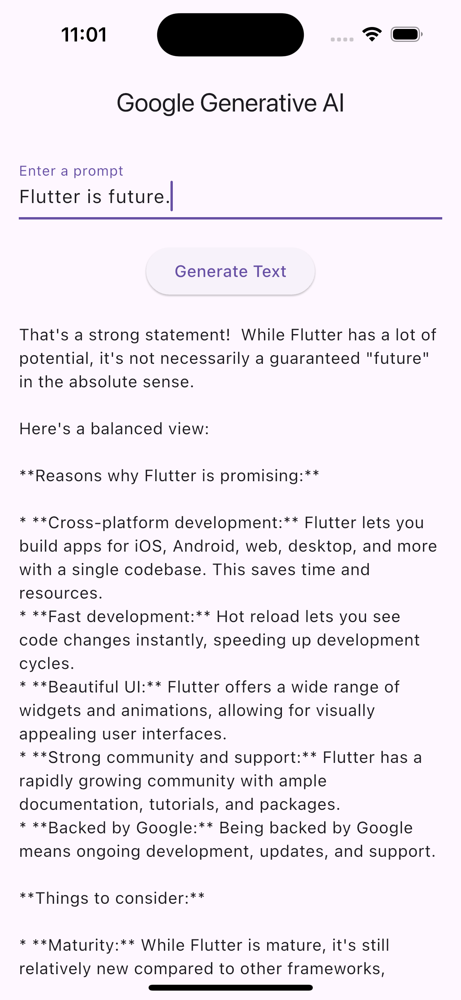

# Generative AI Example

[](README_zh.md)

A Flutter project demonstrating the integration of Google Generative AI.

## Table of Contents

- [Generative AI Example](#generative-ai-example)
  - [Table of Contents](#table-of-contents)
  - [Introduction](#introduction)
  - [Features](#features)
  - [Installation](#installation)
  - [Usage](#usage)
  - [Screenshots](#screenshots)
  - [Contributing](#contributing)
  - [License](#license)

## Introduction

This project showcases how to use Google Generative AI within a Flutter application. It includes examples of generating text responses and streaming responses based on user input.

## Features

- Generate text responses using Google Generative AI.
- Stream text responses in real-time.
- Simple and intuitive UI.

## Installation

To get started with this project, follow these steps:

1. **Clone the repository:**
    ```sh
    git clone https://github.com/your-username/generative_ai_example.git
    cd generative_ai_example
    ```

2. **Install dependencies:**
    ```sh
    flutter pub get
    ```

3. **Run the app:**
    ```sh
    flutter run --dart-define=AI_API_KEY=your_api_key_here
    ```

## Usage

1. **Enter a prompt:** Type a prompt into the text field.
2. **Get Response:** Click on the "Get Response" button to receive a text response.
3. **Get Stream Response:** Click on the "Get Stream Response" button to receive a streaming response.

## Screenshots

|  |  |
|:--------------------------------:|:--------------------------------:|

## Contributing

Contributions are welcome! Please fork the repository and submit a pull request.

1. Fork the repository.
2. Create a new branch (`git checkout -b feature-branch`).
3. Commit your changes (`git commit -m 'Add some feature'`).
4. Push to the branch (`git push origin feature-branch`).
5. Open a pull request.

## License

This project is licensed under the MIT License - see the [LICENSE](LICENSE) file for details.
