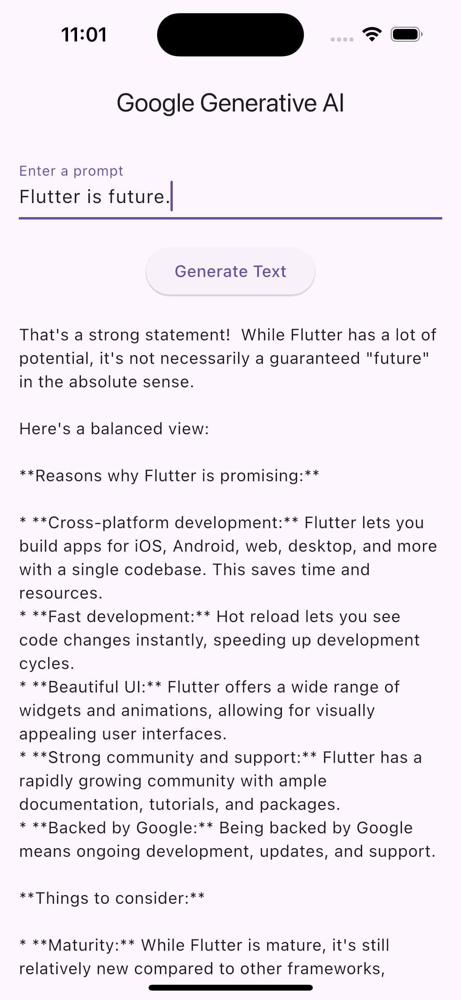

# Generative AI 範例

[](README.md)

一個展示如何在 Flutter 應用程式中整合 Google 生成式 AI 的專案。

## 目錄

- [Generative AI 範例](#generative-ai-範例)
  - [目錄](#目錄)
  - [介紹](#介紹)
  - [功能](#功能)
  - [安裝](#安裝)
  - [使用情境](#使用情境)
  - [截圖](#截圖)
  - [貢獻](#貢獻)
  - [許可證](#許可證)

## 介紹

這個專案展示瞭如何在 Flutter 應用程式中使用 Google Generative AI。它包括產生文字回應和基於使用者輸入的串流回應的範例。

## 功能

- 使用 Google Generative AI 產生文字回應。
- 即時串流文字回應。
- 簡單直覺的使用者介面。

## 安裝

若要開始使用此項目，請按照以下步驟操作：

1. **Clone 倉庫：**
 ```sh
 git clone https://github.com/your-username/generative_ai_example.git
 cd generative_ai_example
 ```

2. **安裝依賴：**
 ```sh
 flutter pub get
 ```

3. **運行應用：**
 ```sh
 flutter run --dart-define=AI_API_KEY=your_api_key_here
 ```

## 使用情境

1. **輸入Prompt：** 在輸入框中輸入Prompt。
2. **取得回應：** 點擊「Get Response」按鈕以接收文字回應。
3. **取得串流響應：** 點擊「Get Stream Response」按鈕以接收串流響應。

## 截圖

|  |  |
|:----------------------------:|:----------------------------:|

## 貢獻

歡迎貢獻！請 fork 倉庫並提交 pull request。

1. Fork 倉庫。
2. 建立新分支 (`git checkout -b feature-branch`)。
3. 提交更改 (`git commit -m 'Add some feature'`)。
4. 推送到分支 (`git push origin feature-branch`)。
5. 開啟 pull request。

## 許可證

此項目根據 MIT 許可證授權 - 有關詳細信息，請參閱 [LICENSE](LICENSE) 文件。